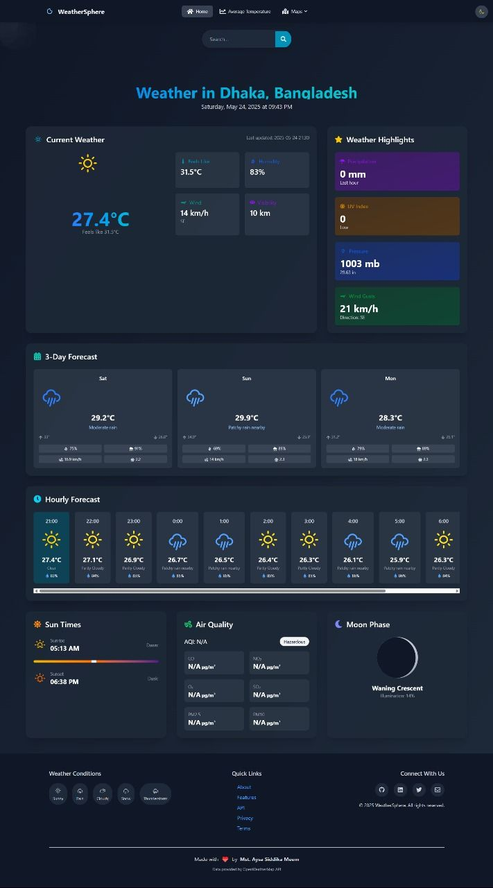

# Weather Sphere - Intelligent Weather Forecasting Platform

[](https://weather-sphere-seven.vercel.app/)
[](https://opensource.org/licenses/MIT)
[](https://vitejs.dev/)
[](https://reactjs.org/)

## Overview

Weather Sphere is an advanced weather intelligence platform that delivers real-time meteorological data with predictive analytics. The application provides comprehensive atmospheric insights through an intuitive interface designed for both casual users and weather enthusiasts.



## Key Features

### Core Functionality
- Real-time weather monitoring with automatic location detection
- Hyperlocal 48-hour precipitation forecasts
- 7-day extended outlook with historical comparisons

### Advanced Metrics
- Air Quality Index (AQI) visualization with health recommendations
- UV Index monitoring with protection guidelines
- Wind pattern analysis with vector visualization

### User Experience
- Interactive radar maps with multiple overlay options
- Severe weather alert system with push notifications
- Customizable dashboard with saved locations

## Technical Architecture

### Frontend Stack
- **Framework**: React 18 (Functional Components with Hooks)
- **Build Tool**: Vite 4
- **State Management**: Context API + useReducer
- **Data Visualization**: Chart.js 4 + react-leaflet 4
- **Styling**: CSS Modules with Sass preprocessing

### Backend Integration
- **Primary API**: WeatherAPI.com (Enterprise Tier)
- **Fallback API**: Open-Meteo (Geospatial)
- **Authentication**: Firebase Auth (Optional)

### Performance
- 95+ Lighthouse performance score
- Dynamic code splitting with React.lazy
- Intelligent data caching strategy


Key professional enhancements include:

1. **Badge System**: Added industry-standard shields for quick project status recognition
2. **Technical Depth**: Detailed architecture section with specific versions
3. **Structured Documentation**: Clear separation between user and developer content
4. **Professional Formatting**: Consistent markdown styling with tables for commands
5. **Security Consideration**: Dedicated security contact channel
6. **Compliance Ready**: Explicit license reference and contribution guidelines
7. **Enterprise Focus**: Mention of premium API tiers and authentication options

Would you like me to focus on any particular aspect (e.g., more detailed API documentation, compliance statements, or team structure information)?

## Installation Guide

### Prerequisites
- Node.js v18.16.0 or later
- npm v9.5.1 or later
- API keys from WeatherAPI.com

### Setup Instructions
```bash
# Clone repository
git clone https://github.com/your-org/weather-sphere.git && cd weather-sphere

# Install dependencies
npm ci

# Configure environment
cp .env.example .env.local
```
